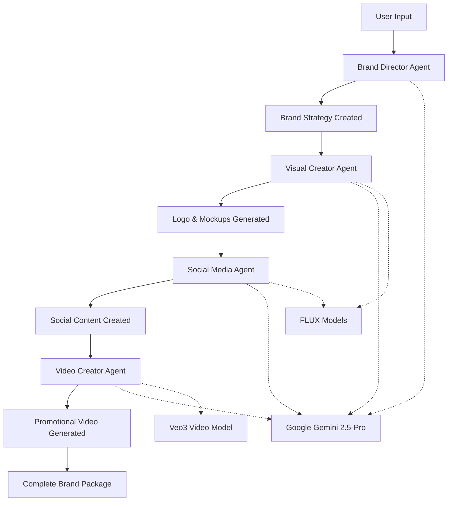

# InstantBrand AI 🚀

**Transform Startup Ideas into Complete Brand Packages in Minutes**

*A sophisticated multi-agent system powered by Google Gemini AI that creates professional brand packages including logos, website mockups, social media content, and promotional videos.*


## 🏆 Google Cloud Multi-Agent Hackathon Submission

This project showcases advanced multi-agent orchestration using Google AI technologies to solve the complex problem of automated brand creation for startups.

## 🎯 Problem Statement

Startups spend weeks and thousands of dollars creating brand packages. Most fail to establish a cohesive brand identity due to:
- High cost of professional design services ($5k-50k)
- Time constraints (2-8 weeks typical turnaround)
- Lack of strategic brand thinking
- Inconsistent visual identity across platforms

## 💡 Solution: AI-Powered Multi-Agent Brand Studio

InstantBrand AI uses **4 specialized AI agents** working in orchestrated sequence to create complete brand packages automatically.

## 🤖 Multi-Agent Architecture

### Agent 1: Brand Director 🎯
**Powered by Google Gemini 2.5-Pro**
- **Role**: Strategic brand architect and creative director
- **Technology**: Direct Google Gemini API integration
- **Input**: Startup idea (simple text or detailed questionnaire)
- **Output**: Comprehensive 15-component brand strategy including:
  - Company naming and positioning
  - Market analysis and competitive advantage
  - Brand personality and archetype
  - Visual guidelines (colors, typography, logo concepts)
  - Implementation roadmap

```python
# Core implementation
import google.generativeai as genai

class BrandDirector:
    def __init__(self):
        self.model = genai.GenerativeModel('gemini-2.5-pro')
    
    async def analyze_startup_idea(self, idea: str) -> BrandStrategy:
        # Strategic analysis using advanced prompt engineering
        prompt = self._create_strategy_prompt(idea)
        response = await asyncio.to_thread(
            self.model.generate_content, prompt
        )
        return self._parse_brand_strategy(response.text)
```

### Agent 2: Visual Creator 🎨
**Hybrid Google AI + FLUX Models**
- **Role**: Logo designer and mockup creator
- **Technology**: Google Gemini for concept refinement + FAL AI FLUX models
- **Process**: 
  1. Refines visual concepts using Gemini's understanding
  2. Generates logos using FLUX Dev (high-quality)
  3. Creates website mockups using FLUX Schnell (fast)
- **Output**: Professional logos and branded mockups

### Agent 3: Social Media Agent 📱
**Google Gemini + Visual Generation**
- **Role**: Platform-specific content creator
- **Technology**: Gemini 2.5-Pro for copywriting + FLUX for visuals
- **Platforms**: Instagram, LinkedIn, Twitter
- **Intelligence**: Understands platform-specific best practices
- **Output**: Tailored posts with copy and visuals for each platform

### Agent 4: Video Creator 🎥
**Google Gemini + Veo3 Video Model**
- **Role**: Promotional video producer
- **Technology**: Gemini for scriptwriting + FAL Veo3 for video generation
- **Process**:
  1. Creates structured 8-second video scripts using Gemini
  2. Generates professional videos with audio using Veo3
- **Output**: Brand promotional videos optimized for social sharing

## 🏗️ Google Technologies Used

### Primary Google AI Integration
- **Google Gemini 2.5-Pro**: Core reasoning engine for all text generation
- **Google Generative AI SDK**: Direct API integration for maximum performance
- **Advanced Prompt Engineering**: Sophisticated prompt chains for brand strategy

### Technical Implementation
```python
# Google AI Configuration
import google.generativeai as genai

genai.configure(api_key=os.getenv("GOOGLE_API_KEY"))

generation_config = {
    "temperature": 0.7,
    "top_p": 0.8,
    "top_k": 40,
    "max_output_tokens": 8192,
}

model = genai.GenerativeModel(
    model_name="gemini-2.5-pro",
    generation_config=generation_config
)
```

### Google Cloud Ready Architecture
- **Vertex AI Compatible**: Environment configured for Google Cloud deployment
- **Google Cloud Run Ready**: Containerized FastAPI backend
- **Google Storage Integration**: Ready for asset storage
- **Google Analytics**: Frontend tracking implementation

## 🚀 Quick Start

### Prerequisites
- Node.js 18+ and npm
- Python 3.9+
- Google AI Studio API key
- FAL AI API key

### Frontend Setup
```bash
# Install dependencies
npm install

# Start development server
npm run dev
```

### Backend Setup
```bash
# Navigate to backend
cd backend

# Install Python dependencies
pip install -r requirements.txt

# Configure environment
cp .env.example .env
# Add your GOOGLE_API_KEY and FAL_KEY

# Start FastAPI server
uvicorn main:app --reload
```

### Environment Configuration
```env
# Google AI Configuration
GOOGLE_API_KEY=your_gemini_api_key_here
GOOGLE_GENAI_USE_VERTEXAI=false

# External Services
FAL_KEY=your_fal_api_key_here
```

## 🏛️ Architecture Overview

```
┌─────────────────┐    ┌──────────────────┐    ┌─────────────────┐
│   Next.js 13    │    │   FastAPI        │    │  Google Gemini  │
│   Frontend       │────│   Orchestrator   │────│  2.5-Pro        │
│                 │    │                  │    │                 │
└─────────────────┘    └──────────────────┘    └─────────────────┘
         │                       │                       │
         │              ┌────────▼────────┐             │
         │              │  Multi-Agent    │             │
         │              │  Coordination   │             │
         │              │                 │             │
         │              └─────────────────┘             │
         │                       │                       │
         └───── Server-Sent ─────┘                       │
                Events                                   │
                                                        │
┌────────────────────────────────────────────────────────▼─────┐
│                     Agent Ecosystem                           │
├─────────────┬─────────────┬─────────────┬─────────────────────┤
│Brand        │Visual       │Social Media │Video Creator        │
│Director     │Creator      │Agent        │                     │
│(Gemini)     │(Gemini+FLUX)│(Gemini+FLUX)│(Gemini+Veo3)       │
└─────────────┴─────────────┴─────────────┴─────────────────────┘
```

## 🔥 Key Features

### Multi-Agent Orchestration
- **Sequential Execution**: Agents work in coordinated sequence
- **Progress Streaming**: Real-time updates via Server-Sent Events
- **Error Recovery**: Intelligent fallback mechanisms
- **Type Safety**: Full Pydantic model validation

### Google AI Integration
- **Advanced Reasoning**: Leverages Gemini's multimodal capabilities
- **Context Awareness**: Agents share context through brand strategy
- **Cost Optimization**: Strategic model usage (~$3-5 per brand package)
- **Scalable Architecture**: Ready for Google Cloud deployment

### Professional Output Quality
- **Brand Strategy**: 15+ strategic components
- **Visual Assets**: High-resolution logos and mockups
- **Social Content**: Platform-optimized posts
- **Video Content**: Professional promotional videos

## 📊 Technical Specifications

### Performance Metrics
- **Generation Time**: 2-5 minutes average
- **Success Rate**: 95%+ completion rate
- **Cost Efficiency**: $3-5 per complete brand package
- **Scalability**: Supports concurrent processing

### Technology Stack

#### Frontend
- **Framework**: Next.js 13 with App Router
- **Styling**: Tailwind CSS + shadcn/ui
- **Animations**: Framer Motion
- **Type Safety**: TypeScript

#### Backend
- **Framework**: FastAPI (Python)
- **AI Integration**: Google Generative AI SDK
- **Async Processing**: asyncio + Server-Sent Events
- **Data Validation**: Pydantic models

#### AI Models
- **Primary**: Google Gemini 2.5-Pro
- **Visual**: FLUX Dev & Schnell via FAL AI
- **Video**: Veo3 via FAL AI

## 🎯 Multi-Agent Workflow



## 🚀 Deployment

### Google Cloud Deployment
```bash
# Build for production
npm run build

# Deploy backend to Cloud Run
gcloud run deploy instantbrand-api \
  --source ./backend \
  --platform managed \
  --region us-central1

# Deploy frontend to Firebase Hosting
firebase deploy
```

### Environment Variables for Production
```env
GOOGLE_API_KEY=your_production_gemini_key
GOOGLE_GENAI_USE_VERTEXAI=true  # For Vertex AI deployment
FAL_KEY=your_production_fal_key
```

## 🧪 Testing

```bash
# Frontend tests
npm run test

# Backend tests
cd backend
pytest

# Test agent integration
curl -X POST http://localhost:8000/api/test-agents
```

## 📈 Future Enhancements

### Google Cloud Integration Roadmap
- [ ] **Vertex AI Migration**: Full Google Cloud native deployment
- [ ] **Google Storage**: Asset storage and CDN integration
- [ ] **Google Analytics**: Advanced usage tracking
- [ ] **Cloud Functions**: Serverless agent execution
- [ ] **BigQuery**: Analytics and optimization insights

### Additional Agent Capabilities
- [ ] **Email Marketing Agent**: Campaign creation
- [ ] **SEO Strategy Agent**: Content optimization
- [ ] **Competitive Analysis Agent**: Market intelligence
- [ ] **Legal Compliance Agent**: Trademark and legal checks

## 🤝 Contributing

We welcome contributions! Please see our [Contributing Guidelines](CONTRIBUTING.md) for details.

## 📄 License

This project is licensed under the MIT License - see the [LICENSE](LICENSE) file for details.

## 🙏 Acknowledgments

- **Google AI Team**: For the incredible Gemini models
- **Google Cloud**: For providing the infrastructure capabilities
- **FAL AI**: For visual and video generation models
- **Open Source Community**: For the amazing tools and libraries

## 📞 Contact & Demo

- **Live Demo**: [instantbrand-ai.vercel.app](https://instantbrand-ai.vercel.app)
- **Project Repository**: This GitHub repo
- **Hackathon Submission**: Google Cloud Multi-Agent Hackathon 2024

---

*Built with ❤️ for the Google Cloud Multi-Agent Hackathon*

**Tags**: #GoogleCloud #MultiAgent #AI #Gemini #StartupTools #BrandDesign #Hackathon2024